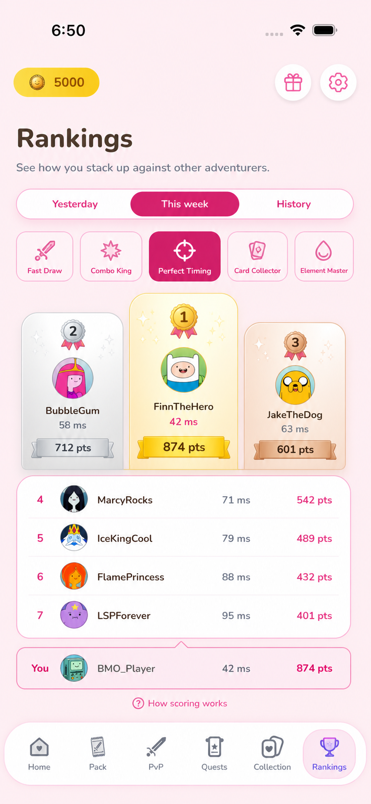
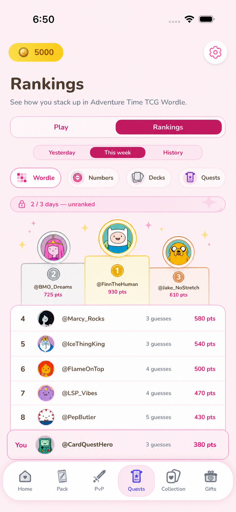
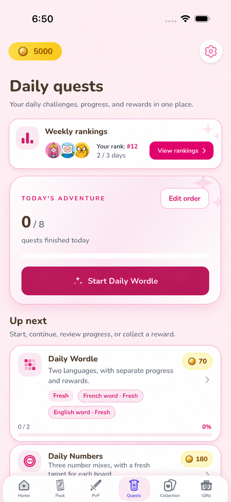

# Leaderboard System Baseline

**Status:** Approved implementation baseline  
**Prepared:** 2026-08-15  
**Approved:** 2026-08-15 by product owner; phased implementation authorized  
**Repository:** Adventure Time TCG Phoenix/web/Expo workspace  
**Design source:** [`docs/design/adventure-time-tcg-redesign.pen`](design/adventure-time-tcg-redesign.pen)

> **Superseded period behavior:**
> [`live-leaderboard-period-spec.md`](live-leaderboard-period-spec.md) replaces this
> baseline's 20:15 UTC closure, eight-hour Step grace, closed-date-only live comparison,
> three-result Weekly qualification, and Yesterday/current-week navigation rules. This
> baseline remains authoritative for scoring formulas, integrity, reward amounts,
> moderation, corrections, and other rules that the newer specification does not replace.

## 1. Purpose

This document records the repository findings, proposed leaderboard product rules,
technical design, integrity requirements, rollout sequence, and resolved product decisions
for a quest leaderboard system.

It is the approved implementation contract. Statements marked **Repository fact**
describe current behavior found in the codebase. Statements marked **Proposed** are
approved provisional launch rules or empirically testable targets; changing them now
requires an explicit specification revision rather than an incidental code decision.

The leaderboard system must:

- provide yesterday, current-week, and historical leaderboards for every ranked quest/mode;
- calculate versioned leaderboard points independently from coins and current quest rewards;
- finalize immutable historical snapshots and award bounded weekly prizes;
- remain server-authoritative and introduce quest-specific integrity checks;
- support mobile and web, including podiums, pinned current-player rows, and safe public profiles;
- collect enough telemetry to recalibrate scoring after at least four full weeks and 500 valid results per quest/mode;
- leave room for a future overall weekly leaderboard without rewarding account age.

### Non-regression invariant

The leaderboard is an additive downstream feature. It must not change existing quest
gameplay or reward behavior. In particular, it must preserve current challenge/puzzle
generation, modes/locales, attempt counts, timers, pause/resume, cash-out, discard/keep,
training, archive play, reset behavior, completion semantics, coin rewards, and claim
flows.

Validation may be strengthened only when the change is wire-compatible and invisible to
normal quest behavior. If a stronger anti-cheat technique would alter a quest, the
leaderboard must use an integrity/eligibility classification or defer prizes rather than
silently redesigning that quest. Any future quest behavior change requires a separate
specification and explicit approval.

## 2. Scope and non-goals

### In scope

- Daily and weekly per-board rankings.
- Closed historical snapshots.
- Versioned scoring configurations.
- Eligibility, integrity, exclusions, moderation, identity rendering, achievements, and weekly non-tradable rewards.
- Phoenix services, Ecto schema changes, Oban jobs, shared contracts/client, Expo UI, responsive web UI, caching, telemetry, migration, and testing.
- A future overall weekly leaderboard design, but not necessarily its first release.

### Out of scope

- Changing existing quest coin rewards.
- Converting leaderboard points into coins, dust, cards, packs, or tradable items.
- Ranking Daily Numbers archive replays, Speed Calculus training, or Perfect Timing training.
- Lifetime/cumulative competitive rankings.
- Retrofactive prizes for legacy results that did not meet the new validation standard.
- Implementing any production code before this specification is approved.
- Changing existing quest gameplay, result selection, attempt/session behavior, or
  reward semantics as a side effect of leaderboard implementation.

## 3. Repository findings

### 3.1 Actual stack

**Repository fact**

- Backend: Phoenix 1.8, Elixir, Ecto, PostgreSQL, Phoenix PubSub/channels, and Oban.
- Mobile: Expo SDK 56, React Native 0.85, Expo Router, NativeWind, and shared theme tokens.
- Web: React with Vite, built into and served by Phoenix in production.
- Shared wire layer: Zod contracts in `packages/contracts` and a typed client in `packages/api-client`.
- Phoenix is the source of truth for auth, persistence, uploads, jobs, and database access.
- Ecto migrations are the schema source of truth.

### 3.2 Current user/profile model

**Repository fact**

The Phoenix `users` model currently includes a UUID identity, email, mutable
`display_name`, avatar data, coins, dust, role, access status, timezone, preferred
language, and preferred step source (`device_health` or `fitbit`).

Current limitations relevant to public competition:

- `display_name` is mutable and not unique; there is no stable public discriminator to
  distinguish duplicate names.
- There is no display-name history or cooldown.
- There is no stable public-profile identifier separate from the private user UUID.
- There is no user-block graph; blocking is also explicitly out of scope for leaderboard
  v1.
- There is no leaderboard-specific eligibility or public-profile moderation state.
- There is no achievement model, leaderboard snapshot model, prize ledger, or non-tradable reward wallet.
- Current account deletion hard-deletes quest/result rows through foreign-key cascades. That conflicts with durable historical snapshots unless snapshots are anonymized and detached from the deleted user.
- Some current surfaces fall back to email when no display name exists. A leaderboard/public profile must never reveal email.

### 3.3 Actual quest inventory versus expected inventory

The expected inventory describes five quest families. The repository materializes
eight daily quest records and therefore needs eight source/detail leaderboard boards.
The selected product structure also adds derived family boards for Daily Numbers and
Wordle, bringing the visible catalog to ten boards.

| Family | Actual daily quest type/board | Actual modes | Expected comparison | Discrepancy or additional behavior |
|---|---|---|---|---|
| Steps | `steps_10k` | Source may be `device_health` or `fitbit` | Total trusted daily steps; higher is better | Expected rule is directionally correct, but device-health uploads are not yet sufficiently trusted for prizes. Current quest completion target is 10,000, while leaderboard scoring needs a separate cap/curve. |
| Daily Numbers | `daily_numbers_1_5` | 1 large + 5 small, alias Classic | Exact completion time; lower is better | Expected inventory mentions Classic and Expert, but repository also has Balanced. All three require separate boards. Non-exact submissions currently earn partial quest rewards but must score zero for ranked results under the proposed competitive rule. |
| Daily Numbers | `daily_numbers_2_4` | 2 large + 4 small, alias Balanced | Not listed | **Additional ranked mode.** |
| Daily Numbers | `daily_numbers_3_3` | 3 large + 3 small, alias Expert | Exact completion time; lower is better | Separate board required. |
| Wordle | `wordle_daily_fr` | French | Guesses; lower is better; failure zero | Repository has language-specific quests, so French and English require separate boards. |
| Wordle | `wordle_daily_en` | English | Guesses; lower is better; failure zero | **Additional locale board relative to a single generic Wordle inventory item.** |
| Speed Calculus | `speed_calculus_daily` | Ranked daily runs plus unranked training | Successful calculations in a fixed ranked session; higher is better | Repository allows up to three daily ranked runs and supports pause/resume/cash-out behavior. A daily ranking-result selection rule is required. |
| Perfect Timing | `perfect_timing_daily` | Official daily attempts plus training target | Absolute error using final kept daily result; lower is better; training excluded; Miss zero | Expected rule matches the intended board, but the repository supports up to three attempts with discard/keep/auto-finalize states, so only the final kept/auto-finalized official result may rank. |

Additional non-board activity:

- Daily login grants 50 coins but is not a `daily_quest` and must not have a leaderboard.
- Daily Numbers archive replays are stored separately and must be excluded.
- Speed Calculus training must be excluded.
- Perfect Timing training must be excluded.
- No other current quest family was found that should receive a leaderboard in this scope.

### 3.4 Current result storage and quest rewards

**Repository fact**

`daily_quests` is the common completion/reward projection, uniquely keyed by user,
date, and quest type. It stores target, progress, completion, reward, claim state, and
timestamps. Quest-specific raw data lives elsewhere.

| Quest | Current raw/result storage | Existing coin reward behavior | Competitive interpretation |
|---|---|---|---|
| Steps | `step_snapshots`, unique by user/source/date, plus progress in `daily_quests` | 75 coins at 10,000-step completion | Rank the same total displayed by the existing quest for the user's selected source; points and caps are independent of the 10,000-step quest reward. |
| Daily Numbers | `daily_numbers_daily_attempts`, unique by user/date/mode; stores submitted expression steps, final value, distance, current 0–100 score, exact/completed flags, and client `elapsed_ms` | Base 45/60/75 coins for 1-5/2-4/3-3, multiplied by current puzzle score percentage | Rank exact solutions only, using validated server elapsed time; non-exact is a valid zero if submitted, and archive rows are excluded. |
| Wordle | One row per guess in `wordle_daily_attempts`, unique by user/date/locale/attempt; stores guess, evaluation, solved | 35 coins for each locale on solve | Derive final guess count or failure from the server-validated sequence. |
| Speed Calculus | `speed_calculus_daily_runs`, up to three runs per user/date; stores seed, answer array, status, score, reward, timing and pause fields | 2 coins per correct answer, capped at 80; the current quest projection/reward follows the latest settled run and supports early cash-out | Rank only an official settled run selected by the approved daily-result rule; never reuse the coin reward as points. |
| Perfect Timing | `perfect_timing_attempts`, up to three official attempts per user/date; stores target, status, stop reason, elapsed, deviation, direction, tier, reward, and microsecond timestamps | Perfect 100, Amazing 75, Great 63, Close 55, Miss 0; successful kept/final result is auto-claimed | Rank only the final official kept or auto-finalized attempt; Miss is a valid zero. |

### 3.5 Current day/reset model

**Repository fact**

- A user's active quest day is calculated from their configured timezone.
- Daily quest rows are lazily materialized when quest state is requested.
- Mobile/UI timers move to the next day at the local cutoff.
- There is no scheduled global midnight materialization or leaderboard close process.
- Reset protection exists through a daily quest UUID/version and date checks, but several endpoints accept the expected version/date as optional.
- Admin reset deletes affected quest-specific rows, resets the daily projection, and broadcasts a quest-reset event.

Consequences for leaderboards:

- Personal quest days cannot safely define a single worldwide competition interval unless the product explicitly chooses timezone-local boards.
- Leaderboard finalization must be scheduled, idempotent, and independent of lazy quest materialization.
- A reset or admin correction must not silently mutate an already closed snapshot.

### 3.6 Current server validation and integrity gaps

**Repository fact**

#### General

- Authenticated Phoenix routes exist, but quest endpoints do not have the same deliberate rate-limit coverage as auth/PvP.
- Several version/reset guards are optional.
- The current result tables were built for quest completion and rewards, not auditable competitive adjudication.

#### Steps

- Fitbit totals are fetched server-side and are the strongest current source.
- Device-health totals can be submitted by the client without sufficient signed evidence.
- The current model does not distinguish manual entries, duplicate contributing sources, device changes, or integrity confidence.

#### Daily Numbers

- The server regenerates the puzzle and validates submitted arithmetic operations, number usage, final value, distance, and exactness.
- `elapsed_ms` is client supplied, normalized, and can default to zero. It is not authoritative enough for a lower-is-better ranking.
- A deterministic same-for-everyone daily puzzle can be pre-solved or shared. That is acceptable for a casual quest but material for valuable competitive prizes.

#### Wordle

- Guesses are validated against the server dictionary and daily solution; evaluation and attempt order are server generated.
- The write path needs explicit transactional locking/idempotency review for competitive concurrency.
- Optional quest-version guards must become mandatory.
- A globally shared daily answer is intrinsically shareable.

#### Speed Calculus

- The server can validate answers against deterministic questions.
- The current client receives enough seed/question information to reconstruct the session and may sync a full answer array.
- Finish does not provide a sufficiently strict server-authoritative session deadline for competition.
- Pause/resume behavior must not extend a ranked clock.

#### Perfect Timing

- The server records start time and currently upper-bounds implausibly long client elapsed reports.
- A client can still fabricate a shorter elapsed time; client precision and network timing also create platform variability.
- Navigation/background recovery is modeled, but ranked validity needs stricter lifecycle and attestation rules.

### 3.7 Missing information that telemetry or product decisions must resolve

- Real result distributions by quest/mode, platform, source, and app version.
- Expected weekly active population and leaderboard page depth.
- Acceptable false-positive/false-negative rates for integrity enforcement.
- Final competition timezone and week boundary.
- Whether all current modes/locales deserve independent prizes at launch.
- Whether Speed Calculus uses best, last, first, or a dedicated single official run.
- Whether tied players share medals and reward grants.
- Final reward token/name/caps and whether achievements repeat by week.
- Display-name change, reserved-word, impersonation, and moderation policy.
- Privacy/legal acceptance of anonymized historical competitive records after account deletion.
- Integrity limitations of device-health steps are accepted for this bounded leaderboard;
  source type does not change visibility or prize eligibility.
- The intended consequence of late-arriving Fitbit corrections after a daily/weekly close.

## 4. Proposed product rules

### 4.1 Board catalog

**Selected:** launch with eight source/detail boards plus two derived family boards.

| Board key | Family | Mode | Better direction | Raw result shown |
|---|---|---|---|---|
| `steps/default` | Steps | Trusted total | Higher | Steps |
| `daily-numbers/1-5` | Daily Numbers | Classic / 1-5 | Lower | Exact completion time |
| `daily-numbers/2-4` | Daily Numbers | Balanced / 2-4 | Lower | Exact completion time |
| `daily-numbers/3-3` | Daily Numbers | Expert / 3-3 | Lower | Exact completion time |
| `wordle/fr` | Wordle | French | Lower | Guesses or Failed |
| `wordle/en` | Wordle | English | Lower | Guesses or Failed |
| `speed-calculus/ranked` | Speed Calculus | Ranked | Higher | Correct answers |
| `perfect-timing/official` | Perfect Timing | Official daily | Lower | Absolute error or Miss |
| `daily-numbers/family` | Daily Numbers | Derived across 1-5, 2-4, and 3-3 | Points | Equal average of all three member-board weekly scores; missing members are zero |
| `wordle/family` | Wordle | Derived across French and English | Points | Equal average of both member-board weekly scores; missing members are zero |

The catalog is data-driven so modes can be disabled, made read-only, or added without
hard-coding query behavior across clients. Derived family boards reference member boards
and never accept a client-submitted raw result of their own.

Derived family-board formula:

```text
family_period_points = round_half_up(
  sum(member_board_period_points, with missing members = 0) / member_board_count
)
```

- Daily Numbers family daily score = `(1-5 daily + 2-4 daily + 3-3 daily) / 3`.
- Daily Numbers family weekly score = `(1-5 weekly + 2-4 weekly + 3-3 weekly) / 3`.
- Wordle family daily score = `(French daily + English daily) / 2`.
- Wordle family weekly score = `(French weekly + English weekly) / 2`.
- Member boards have equal weight because their 0–1,000 scoring curves are expected to
  normalize difficulty. Missing or ineligible member results contribute zero.
- Family rows expose a safe member breakdown so players can understand the average.

### 4.2 Competition calendar

**Selected direction:** use a locked per-player competition timezone and a natural local
day. A single `Europe/Paris` calendar was the initial proposal and has been rejected in
favor of equal local-day access. The remaining decisions concern grace windows and how
much provisional information to show before a civil date closes globally.

Fairness has four distinct dimensions:

1. **Equal access duration:** every player receives the same amount of time to play.
2. **Local-day convenience:** the available window includes a natural waking day and
   Steps represents the player's actual local calendar day.
3. **Simultaneous challenge:** players cannot see a result/solution from an earlier
   timezone before their own challenge opens.
4. **Administrative consistency:** every board has an unambiguous date, week, closure,
   snapshot, and anti-timezone-gaming rule.

No calendar model maximizes all four dimensions.

| Model | Strengths | Weaknesses | Assessment |
|---|---|---|---|
| One global Paris day | Same absolute 24-hour window and challenge for everyone; simple closure; convenient for the largest current cohort | Resets around 18:00/19:00 in New York and morning in parts of Asia; non-France Steps no longer match a natural health-data day; visibly France-centered | Simple, but not globally neutral and poor for Steps |
| One global UTC day | Same absolute window; neutral standard; simplest backend/audit model | Local reset is still inconvenient in many zones; Steps do not match most players' local health day | Technically clean, but user experience and Steps remain problematic |
| Locked per-player competition timezone | Every player gets a natural midnight-to-midnight day and seven local Monday–Sunday slots; Step sources align naturally | Civil-date boards span up to 26 hours worldwide; earlier zones can share Wordle/Daily Numbers answers; live standings and finalization must wait; timezone changes can be abused without strict controls | Strongest local-access fairness; operational complexity is manageable |
| Wider global window, such as 36 hours | Same absolute duration with at least one useful waking window almost everywhere | Consecutive daily windows overlap; players can have two challenges open; more answer sharing and more complex result assignment; Steps still need a special rule | Useful for occasional events, awkward for a permanent daily system |
| Regional boards/timezone bands | Natural hours and more simultaneous regional play | Fragments a small population, complicates prizes, and makes a true global leaderboard unclear | Not recommended at current population size |
| Hybrid: local Steps, global skill quests | Steps are natural while puzzle sessions remain simultaneous | Users must understand two reset systems; weekly aggregation and navigation become harder to explain | Technically fair by quest, but product complexity is high |

The selected direction uses a server-controlled effective competition timezone for all
daily boards, with the following safeguards:

- The app reports its current IANA timezone on authenticated launch/resume. Phoenix
  stores the detected timezone separately from the effective timezone used by an open
  competition slot.
- Initial leaderboard participation defaults from the user's existing configured
  timezone.
- Give every player one midnight-to-midnight local slot per civil date and seven local
  Monday–Sunday slots per competition week.
- A detected timezone change applies automatically to the next unopened daily slot; it
  never changes the UTC boundaries of a slot already in progress.
- Server-owned monotonic slot numbering prevents an eighth weekly slot, a second result
  for the same board/slot, reopening an expired date, or skipping ahead to an unreleased
  challenge merely by changing the device timezone.
- Daylight-saving transitions within the same IANA timezone are legitimate 23- or
  25-hour local days. Larger offset changes are logged as travel/integrity telemetry.
- Do not include a civil date in the shared current-week comparison until that date is
  available to all supported timezones. Earlier-zone results may be recorded but are
  withheld from comparative live scoring until the common comparison point.
- Close a daily civil-date snapshot only after that date has ended in the latest
  supported timezone plus grace. Close the week only after Sunday has ended across the
  fixed supported timezone envelope.
- Show a clear `Provisional — some timezones are still playing` state while a date is
  incomplete globally.
- Treat shared-answer leakage as a separate quest-design decision: accept it for bounded
  social prizes, or introduce calibrated challenge pools for quests where it becomes a
  material problem.

This direction favors equal local access and Step correctness over simultaneous puzzle
release. Shared-answer leakage remains a separate quest-design and prize-risk decision.

#### Automatic timezone following

**Selected product behavior:** follow the device's IANA timezone automatically for
legitimate travel, subject to server-controlled slot integrity.

The phone timezone is a convenience signal, not authority to create a result period.
Phoenix creates monotonic `competition_slot` records. Each slot stores the detected and
effective timezone plus immutable UTC start/end boundaries. Changing the phone timezone:

- does not alter or extend the current slot;
- does not reopen a completed local date;
- applies to the next slot without requiring a manual settings change;
- cannot create more than seven daily slots in a competition week;
- cannot reveal a future challenge before the next server-owned slot opens;
- is recorded for anomaly analysis without requiring continuous location permission.

Repeated or implausible timezone changes are recorded as integrity telemetry but do not
automatically reduce points, hide standings, or remove prize eligibility. Server-owned
immutable slot boundaries, the seven-slot weekly maximum, and challenge-release guards
remove the direct competitive benefit. A moderator may still investigate the telemetry
when it correlates with a separate integrity violation; timezone changes alone are not a
violation.

#### Result processing with natural local days

Result processing and leaderboard finalization are deliberately separate:

1. **Immediate validation and provisional scoring**
   - When a player submits or completes a quest, Phoenix validates it immediately,
     records the normalized daily result, assigns the scoring version, and calculates
     provisional leaderboard points.
   - The player immediately sees their own raw result and provisional points.
   - Existing quest coins/rewards continue to settle according to their current quest
     rules; they do not wait for leaderboard closure.
2. **Local-day lock**
   - The result belongs to the civil date in the competition timezone that was locked
     for that player when the week opened.
   - Leaderboard attribution for the ending slot has a hard local-midnight cutoff. No
     post-midnight action can improve the ending date's leaderboard result.
   - This cutoff does not introduce a new quest restriction. Existing quest reset,
     in-flight session, completion, and reward behavior remains unchanged. If current
     quest behavior settles an action after the ranking cutoff, it may still affect the
     quest while being ineligible for the closed leaderboard slot.
   - Only an event already timestamped by the server before the cutoff may finish
     leaderboard transactional settlement afterward. An HTTP request first received
     after midnight is not treated as proof that ranked play finished before midnight.
   - Steps receive a longer, equal per-player source-sync grace because provider/device
     totals may arrive after local midnight.
3. **Global comparability gate**
   - The shared daily board for civil date `D` is not finalized until `D` has ended in
     the latest supported competition timezone and that board's grace window has passed.
   - Use a fixed supported timezone envelope rather than the current player population,
     so close times cannot move when a player joins and no country is treated as an
     exceptional case.
   - Accepted results may be stored earlier, but date `D` does not add an extra counted
     weekly slot for earlier timezones while later timezones are still playing.
4. **Daily snapshot and weekly update**
   - The finalizer locks the board/date, settles pending sessions, applies integrity and
     eligibility decisions, creates the closed daily snapshot, and invalidates caches.
   - The current-week leaderboard then recomputes from globally closed daily dates only.
   - UI copy states the cutoff explicitly, for example `Standings through Monday`, while
     the player's newer local result appears separately as `Today — pending close`.
5. **Weekly closure and prizes**
   - Sunday is finalized only after Sunday has ended in the latest supported timezone
     and the relevant grace has passed.
   - Skill-board inputs may settle internally before Steps, but public snapshots remain
     staged until the common publication cutoff.
   - All boards publish together and all weekly prizes are released together after the
     longest required Steps source-sync grace.

Provisional concrete schedule using the safe global timezone envelope UTC+14 through
UTC-12:

- Skill leaderboard-attribution cutoff: hard local midnight, with no post-midnight
  action counted for the ending slot and no change to underlying quest behavior.
- Skill board inputs for civil date `D`: internally settled after `D` has ended across
  the safe timezone envelope, but not published yet.
- Steps source-sync grace: 8 hours after each player's local midnight.
- Common public daily snapshot for civil date `D`: publish at
  approximately `D + 1 day, 20:15 UTC` after Steps settle and the finalizer runs.
- Common public weekly snapshot and all prizes: publish Monday at approximately
  20:15 UTC.

During European summer time, that would make all weekly results and prizes public around
22:15 Monday in France and 16:15 in New York. Daylight-saving changes do not alter
anyone's local midnight-to-midnight entitlement because boundaries are calculated from
the IANA timezone database.

The 8-hour Steps window is selected but remains configurable for future telemetry-driven
adjustment. The skill leaderboard-attribution cutoff is fixed at local midnight. The approximately 15 minutes
between the last Steps ingestion deadline and public publication is job-processing
buffer, not additional gameplay or synchronization time.

#### Why Steps may require a longer data-settlement window

Steps differ internally from the skill quests, although they do not have to publish at
a different user-facing time:

- Wordle, Daily Numbers, Speed Calculus, and Perfect Timing have a discrete authenticated
  server request that ends the result. Once that request is accepted, the raw result no
  longer changes.
- Steps accumulate until local midnight and originate outside Phoenix. Fitbit may be
  fetched by the server, while device-health totals normally reach Phoenix only when the
  device synchronizes.
- A post-midnight provider sync can legitimately contain steps walked before midnight.
  Rejecting all late-arriving source data would undercount players whose device or
  provider synchronized slowly.
- A Steps grace window is an ingestion window, not extra walking time. Only trusted
  source samples whose timestamps belong to the closed local date may be added.

There are three publication choices:

1. Publish every board together after the longest required grace. This is simplest for
   players and gives one daily/weekly reveal time, but skill standings wait longer even
   though their data is ready.
2. Finalize skill boards earlier and Steps later. This is faster per board but introduces
   two reveal/prize times.
3. Give Steps no additional grace and require a trusted sync by midnight. This is fastest
   but is likely to omit legitimate end-of-day steps, especially for device-health users.

**Selected:** option 1. Keep different internal settlement rules but use one common
public snapshot/prize time after the Steps window. This makes the source-reliability
detail invisible to ordinary players.

Leaderboard periods expose:

- **Yesterday:** the most recently closed comparable daily period, not merely the
  viewer's last local date if other timezones are still playing it.
- **Current week:** aggregation through the most recently globally closed civil date,
  plus the viewer's newer pending local result outside the shared rank.
- **Historical:** a weekly-first archive; opening a closed week reveals its seven closed
  daily snapshots for the selected board.
- **Legacy:** a separate archive containing only pre-launch source results that can be
  reconstructed with documented confidence. Legacy periods are labeled
  `Legacy — unverified`, never appear in verified Yesterday/This Week/History views,
  never affect personal bests or qualification, and can never award rank achievements,
  medals, Crowns, or other prizes. Existing quest-history screens and records are not
  changed by this import.

The server advertises local slot boundaries for the viewer, global comparison/finalization
cutoffs, `status`, and authoritative `serverNow` in every leaderboard response.

### 4.3 Result lifecycle

Each raw quest outcome is normalized into one `daily_result` for one user, board, and
competition date. It moves through:

`pending -> accepted | rejected | excluded -> snapshotted`

- `pending`: awaiting a source sync, end-of-session settlement, or asynchronous integrity check.
- `accepted`: eligible to appear and count.
- `rejected`: structurally invalid/cheating/unsupported; never counts.
- `excluded`: valid game activity but intentionally non-ranked, moderated,
  administratively invalidated, training, or archive play. Reconstructable pre-launch
  results use the separate legacy-archive projection below rather than entering this
  verified lifecycle.
- `snapshotted`: an accepted result copied into a closed snapshot. The source record remains auditable.

Only the result recorder service may create or replace the normalized daily result.
Clients cannot submit leaderboard points.

### 4.4 Failures, missed days, and provisional status

- A submitted/settled failure is a **valid zero-point result**, not a missing result. It
  appears in the daily leaderboard and counts toward the three-result weekly
  qualification requirement.
- Wordle failure after six guesses scores zero.
- Daily Numbers non-exact final submission is a valid `Not exact` failure: it appears in
  the daily board, counts toward weekly qualification, and scores zero.
- Speed Calculus an accepted official session with zero correct scores zero.
- Perfect Timing Miss scores zero.
- A missed day has no daily row, does not count toward weekly qualification, and is not
  converted into a stored zero result.
- Rejected/excluded activity does not become a valid failure and is not displayed as a competitive result.

Weekly provisional status is true when:

- the week is still open;
- any counted result is pending integrity review.

A player with fewer than three valid daily results is **unranked**, not provisionally
ranked. The pinned player area shows qualification progress such as
`Unranked — 2/3 results`. Once the third result closes globally, the player enters the
weekly standings. This restriction applies only to weekly ranking: every valid result
still appears in its closed daily leaderboard regardless of the player's weekly
qualification count.

### 4.5 Weekly aggregation

**Selected qualification rule:** a player must have at least three valid daily results
for the board in the week. A qualified player's weekly score is the average of their
best three valid daily point results.

Let:

- `P` be the player's valid accepted/failure daily point values for globally closed civil
  dates in the week;
- `best(P, 3)` be the highest three point values.

Then:

```text
if count(P) < 3: weekly_status = unranked
else weekly_points = round_half_up(sum(best(P, 3)) / 3)
```

Consequences:

- Shared weekly ranks cannot exist before at least some players have three globally closed
  valid results, normally after Wednesday closes worldwide.
- Players join the weekly standings as soon as their third valid result closes globally.
- Missing days do not create a stored zero result and do not help qualification.
- A first launch week uses only competition days from the launch timestamp forward, so pre-launch days do not penalize anyone.
- The first partial launch week is explicitly a preview period: standings are visible,
  but `prizes_enabled` is false and no achievements or leaderboard rewards are granted.
- Official prize competition begins with the first complete Monday–Sunday week after
  launch.
- A later player signup does not reduce the three-result requirement; otherwise joining
  late would confer an advantage.
- Closed weekly scores store the selected result IDs and point vector for auditability.

### 4.6 Daily-result selection within multi-attempt quests

**Proposed defaults:**

- Steps: the final accepted total displayed by the existing quest for the user's selected
  source at close, capped only by the scoring formula. Never combine device health and
  Fitbit totals.
- Daily Numbers: the one official daily submission for that mode.
- Wordle: the completed official attempt sequence for that locale.
- Speed Calculus: the final/latest settled official run among at most three daily ranked
  runs. A later run replaces the earlier provisional daily result even when its score is
  lower. Cashing out/locking the quest selects the latest settled run and prevents
  another official run. Starting a later official run is an explicit commitment to
  replace the prior result; the UI warns the player before start. Abandonment, timeout,
  or unrecovered exit settles that latest run as a valid zero-point result.
- Perfect Timing: the final kept or auto-finalized official result; discarded attempts do not count.

### 4.7 Ties and ranks

**Selected:** use competition ranking (`1, 1, 3`) rather than dense ranking.

- Daily sort: leaderboard points descending, then the natural raw result (higher/lower according to the board).
- Weekly sort: weekly points descending, then the sorted vector of the selected daily points descending.
- If all competitive values remain equal, players are genuinely tied. Signup time,
  account age, display name/handle, submission timestamp, and user ID are not competitive
  tiebreakers.
- All genuinely tied players receive the full medal and reward for their shared rank,
  with no weekly or lifetime accumulation cap. A skipped rank also skips its medal tier:
  `1, 1, 3` awards two Golds, no Silver, and one Bronze.
- Pagination is by ordered row position, while `rank` may repeat.

### 4.8 Closed snapshots and corrections

- An open period may update as accepted results arrive.
- Closing produces a snapshot with an immutable scoring version, ordered rows, ranks, raw-result summaries, selected source-result IDs, and finalization metadata.
- Ordinary late data does not rewrite a closed snapshot.
- **Selected correction rule:** an authorized correction creates a new snapshot revision,
  retains the superseded revision, records a reason/actor, reconciles affected prizes
  idempotently, and emits an audit event. Closed rows are never edited in place.
- **Selected reward-reconciliation rule:** when a revision changes the podium, its single
  transaction reverses displaced achievements and Crown grants, subtracts those Crowns
  from the corresponding family wallets, and grants the corrected winners. Reversed
  records remain in the private audit ledger but are excluded from public achievement,
  medal, and Crown totals. Because Crowns are non-spendable, reversal cannot create a
  debt or claw back a consumed benefit.
- Historical results are never rescored merely because a new scoring formula is activated.

### 4.9 Weekly prizes

**Proposed:** each closed board awards:

- Gold achievement plus 3 non-tradable **Crowns**;
- Silver achievement plus 2 Crowns;
- Bronze achievement plus 1 Crown.

Guardrails:

- Crowns are separate from coins, dust, cards, packs, and quest rewards.
- Crowns cannot be transferred, traded, sold, gifted, converted, or purchased.
- There is no per-week or lifetime Crown accumulation cap.
- Each individual podium award remains bounded at 3/2/1 Crowns for Gold/Silver/Bronze.
- Crowns have five quest-family types: `steps`, `daily_numbers`, `wordle`,
  `speed_calculus`, and `perfect_timing`.
- Every source/detail or aggregate family board maps to exactly one of those types. For
  example, all three Daily Numbers modes and its derived family board award
  `daily_numbers` Crowns.
- Profiles show each family count and a combined total derived as their sum.
- Duplicate/idempotency key: snapshot revision + board + medal tier + user.
- Tied medalists receive the full corresponding achievement/reward. Rewards are not
  divided between tied players.
- An excluded or ineligible player is removed before medal assignment, not after prizes are issued.

The first release may display Crowns as recognition-only while redemption behavior is
deferred. No economic value should be implied until a separate product decision defines
safe sinks.

### 4.10 Leaderboard rows and public profiles

Every leaderboard response contains:

- rank;
- profile picture or deterministic fallback;
- current safe public handle (`display name#discriminator`);
- localized raw result;
- leaderboard points;
- provisional/integrity state when applicable;
- achievement/medal indicator where relevant.

The current player's row is returned separately and pinned below/above the visible list
when it is outside the current page. It does not get duplicated if already present.

A lightweight community profile, visible only to authenticated approved players, may
expose only:

- public profile ID;
- safe display name, discriminator, and combined public handle;
- avatar or fallback;
- five quest-family Crown counts and their combined total;
- Gold/Silver/Bronze achievement totals;
- the ten most recent closed podiums/placements, identified by board and competition
  period rather than exact activity timestamps;
- safe per-quest personal bests derived only from closed accepted results, including
  mode/locale-specific values where relevant;

It must not expose email, auth providers, private UUIDs, timezone, preferred source,
device data, integrity flags, moderation notes, exact login/activity history, coin/dust
balances, inventory, or private social data.

### 4.11 Identity, moderation, and deletion

**Selected identity behavior:**

- Keep the current mutable, non-unique `display_name` and add a stable random public
  discriminator, rendered together as a handle such as `Finn#A4K2`.
- The discriminator is generated by the server, never changes, and does not encode the
  email or private user UUID.
- A stable `public_profile_id` is the public route identifier.
- Closed rows store competitive facts but resolve the current safe display name,
  discriminator, and avatar at read time.
- Display-name history exists for moderation/audit and anti-impersonation controls.
- Display-name changes have no product cooldown and appear immediately on current and
  historical leaderboard reads. Existing validation plus reserved-word, profanity, and
  impersonation moderation applies; the immutable discriminator remains the stable
  identity marker.
- Missing avatar uses a deterministic Adventure Time-themed fallback selected by hashing
  the public profile ID into an approved fallback asset set. The assignment is stable,
  contains no email/private-ID encoding, and is identical across leaderboard/profile
  surfaces.
- No block feature or block-specific leaderboard behavior is included in v1. A future
  social-block feature requires a separate product decision and migration.
- A profile-hidden/moderated account renders `Player hidden`; competitive placement remains unless its results are separately excluded.
- Profile moderation changes only the public identity projection. Competitive result
  exclusion is a separate privileged action with its own reason, actor, audit record,
  and snapshot-revision workflow.
- **Selected deletion rule:** closed snapshot rows retain rank, raw result, and points but
  replace all identity linkage with an anonymous tombstone. Open-week results are
  removed before finalization/prizes. Public-profile routes return not found/gone, and
  Crown wallets, achievements linked to the account, discriminator, avatar, and display
  history are deleted with the account.
- Moderator actions on profile visibility and result eligibility are separate. Hiding a profile must not silently change standings.

## 5. Scoring engine

### 5.1 Principles

- Quest logic produces a validated raw outcome; scoring configuration maps it to points.
- Display points use a common 0–1,000 normalized scale so unlike quests can be combined.
- Store `points_milli` as an integer from 0 to 1,000,000 to avoid floating-point drift.
- API display points are derived from `points_milli` using one documented rounding rule.
- Raw results are never artificially capped. For open-ended higher-is-better quests,
  monotonic saturating formulas approach 1,000 without reaching a finite performance
  plateau. Every better raw result produces greater precise points.
- Quests with a natural best outcome may reach 1,000: Wordle in one guess and Perfect
  Timing with exact timing.
- Formula identifiers and parameters are allow-listed data, not executable expressions.
- A scoring version is immutable after activation.
- A version activates only at a future Monday/complete competition-week boundary, never
  mid-week.
- The daily result stores the scoring-version ID and calculated point value.

### 5.2 Provisional formulas

#### Steps

```text
points = 1000 * (1 - exp(-displayed_steps_for_selected_source / scale_steps))
```

Selected launch `scale_steps = 20,000`. There is no Step cap: every additional accepted Step
increases precise points, with diminishing influence on cross-quest aggregates.

#### Daily Numbers

**Selected result rule:** exact valid solutions receive formula points. A finalized
non-exact submission is a valid zero-point failure.

```text
if not exact: points = 0
else points = base_points + (1000 - base_points) * scale_ms / (scale_ms + server_elapsed_ms)
```

Selected launch values:

- 1-5: `scale_ms = 120,000`
- 2-4: `scale_ms = 120,000`
- 3-3: `scale_ms = 120,000`
- `base_points = 100` as the asymptotic lower bound for increasingly slow exact results;
  no finite exact time hits a floor plateau.

The formula rewards faster solutions while reducing extreme sensitivity at the fastest
end. Telemetry must determine whether mode-specific scales are appropriate.

#### Wordle

Selected launch lookup:

| Outcome | Points |
|---|---:|
| Solved in 1 | 1,000 |
| Solved in 2 | 900 |
| Solved in 3 | 750 |
| Solved in 4 | 550 |
| Solved in 5 | 350 |
| Solved in 6 | 200 |
| Failed | 0 |

#### Speed Calculus

```text
points = 1000 * (1 - exp(-correct_answers / scale_correct))
```

Selected launch `scale_correct = 20`. There is no arbitrary correct-answer cap; the fixed
session duration supplies the practical limit and every additional correct answer
increases precise points.

#### Perfect Timing

```text
if tier == miss: points = 0
else points = 100 + 900 * (max_ranked_error_ms - absolute_error_ms) / max_ranked_error_ms
```

Selected launch `max_ranked_error_ms = 300`, with the result clamped to `[100, 1000]`
for successful results and Miss fixed at zero.

### 5.3 Configuration format

```json
{
  "schemaVersion": 1,
  "version": "2026-W40-v1",
  "effectiveCompetitionWeek": "2026-09-28",
  "points": {
    "displayMax": 1000,
    "storageScale": 1000,
    "rounding": "half_up"
  },
  "boards": {
    "steps/default": {
      "formula": "saturating_higher_better",
      "parameters": { "minimum": 0, "scale": 20000 }
    },
    "daily-numbers/1-5": {
      "formula": "exact_asymptotic_lower_better",
      "parameters": { "scaleMs": 120000, "basePoints": 100 }
    },
    "daily-numbers/2-4": {
      "formula": "exact_asymptotic_lower_better",
      "parameters": { "scaleMs": 120000, "basePoints": 100 }
    },
    "daily-numbers/3-3": {
      "formula": "exact_asymptotic_lower_better",
      "parameters": { "scaleMs": 120000, "basePoints": 100 }
    },
    "wordle/fr": {
      "formula": "outcome_lookup",
      "parameters": {
        "solved": { "1": 1000, "2": 900, "3": 750, "4": 550, "5": 350, "6": 200 },
        "failed": 0
      }
    },
    "wordle/en": {
      "formula": "outcome_lookup",
      "parameters": {
        "solved": { "1": 1000, "2": 900, "3": 750, "4": 550, "5": 350, "6": 200 },
        "failed": 0
      }
    },
    "speed-calculus/ranked": {
      "formula": "saturating_higher_better",
      "parameters": { "minimum": 0, "scale": 20 }
    },
    "perfect-timing/official": {
      "formula": "successful_linear_error",
      "parameters": { "missPoints": 0, "minimumSuccessfulPoints": 100, "maxErrorMs": 300 }
    },
    "daily-numbers/family": {
      "formula": "derived_equal_average",
      "parameters": {
        "members": ["daily-numbers/1-5", "daily-numbers/2-4", "daily-numbers/3-3"],
        "missingMemberPoints": 0
      }
    },
    "wordle/family": {
      "formula": "derived_equal_average",
      "parameters": {
        "members": ["wordle/fr", "wordle/en"],
        "missingMemberPoints": 0
      }
    }
  },
  "weekly": {
    "formula": "average_best_n_qualified",
    "bestResults": 3,
    "minimumValidResults": 3
  }
}
```

Activation validation must reject unknown formulas, missing/extra parameters, values
outside safe ranges, duplicate version names, invalid effective weeks, or incomplete
board coverage.

## 6. Proposed data model

All identifiers use UUIDs unless noted. All timestamps use UTC; competition-local dates
are stored explicitly where required.

### 6.1 User/profile changes

Add to `users`:

- `public_discriminator` (short server-generated public code, unique and immutable);
- `public_profile_id` (UUID, unique, not guessable from private identity);
- `public_profile_status` (`visible`, `hidden`, `moderated`, `deleted` projection);
- `leaderboard_eligible` (boolean, default true for approved accounts);
- `display_name_changed_at`;
- optional `deleted_at` only if account lifecycle changes from immediate hard delete to anonymization/tombstone.

Indexes:

- unique index on `public_discriminator`;
- unique index on `public_profile_id`;
- eligibility/status index only if moderation queries require it.

### 6.2 `leaderboard_boards`

Catalog of rankable quest/mode combinations.

- `id`, `key`, `quest_family`, `mode`, `direction`;
- `board_kind` (`source`, `derived_family`) and derived-member configuration;
- `enabled`, `prizes_enabled`, `display_order`;
- `raw_result_kind`, `validation_policy`;
- timestamps.

Indexes/constraints:

- unique `key`;
- unique family/mode combination;
- check direction and raw-result-kind enums.

### 6.3 `leaderboard_scoring_versions`

- `id`, `version`, `schema_version`;
- immutable `configuration` JSONB;
- `effective_week_start`, `status` (`draft`, `scheduled`, `active`, `retired`);
- `created_by_user_id`, `activated_at`, timestamps.

Indexes/constraints:

- unique `version`;
- exclusion/transactional guard preventing overlapping active coverage;
- index on effective week/status.

### 6.4 `leaderboard_competition_slots`

Server-owned personal day slots prevent device-timezone changes from creating additional
or extended ranked days.

- `id`, `user_id`, `competition_week_key`, `slot_number` (1–7);
- `local_date`, `detected_timezone`, `effective_timezone`;
- immutable `starts_at` and `ends_at` UTC boundaries;
- `status` (`scheduled`, `open`, `closed`, `void`), timezone-change reason/metadata;
- timestamps.

Indexes/constraints:

- unique user/week/slot number;
- no overlapping open time ranges for one user;
- partial unique index for one open slot per user;
- status/end-time index for slot-closing jobs;
- service-level rule that a timezone change can affect only the next unopened slot.

### 6.5 `ranked_sessions`

Server-authoritative session envelope for timed/interactive quests.

- `id`, `user_id`, `board_id`, `competition_slot_id`, `competition_date`;
- `quest_record_id`/source reference where applicable;
- `session_number`, `status`;
- server start/deadline/end timestamps;
- challenge/puzzle version, nonce/hash, app/platform/attestation metadata;
- integrity state and reason codes;
- timestamps.

Indexes/constraints:

- unique user/board/date/session number;
- partial index for active sessions;
- index on status/deadline for recovery jobs;
- board-specific maximum-session enforcement in the transaction/service layer.

### 6.6 `leaderboard_daily_results`

Normalized competitive result, one per user/board/competition date.

- `id`, `user_id`, `board_id`, `competition_slot_id`, `competition_date`;
- `ranked_session_id` where applicable;
- polymorphic source reference or explicit source table/ID fields;
- `raw_result` JSONB with a board-schema version;
- indexed scalar columns needed for sorting/telemetry, such as `raw_numeric_value`, `outcome`;
- `points_milli`, `scoring_version_id`;
- `result_status`, `integrity_status`, `eligibility_status`;
- `provisional`, `submitted_at`, `accepted_at`;
- `supersedes_result_id`, exclusion reason/actor/timestamp;
- timestamps.

Indexes/constraints:

- unique active result by user/board/date;
- board/date/status/points descending for daily reads;
- user/board/date descending for profile/history;
- scoring-version and integrity-status indexes for audit/telemetry;
- check points range and raw-result schema.

Pre-launch results are not inserted into this verified competitive table by the legacy
import. The importer writes a separate, read-only legacy projection so a later mistake
cannot accidentally make those rows prize-eligible.

### 6.7 `leaderboard_periods`

- `id`, `period_type` (`day`, `week`), `competition_timezone`;
- `starts_at`, `ends_at`, `closes_at`, `competition_date` or `week_start`;
- `status` (`scheduled`, `open`, `closing`, `closed`, `corrected`);
- `origin` (`verified`, `legacy_unverified`), `prizes_allowed`;
- `scoring_version_id`, `launch_partial`, timestamps.

Indexes/constraints:

- unique period type + start;
- index on status/closes_at for finalizers.
- database check requiring `prizes_allowed = false` when origin is
  `legacy_unverified`.

### 6.8 `leaderboard_snapshots`

- `id`, `period_id`, `board_id`, `revision`;
- `status`, `scoring_version_id`;
- participant/result counts;
- configuration hash/source cutoff;
- `finalized_at`, `finalized_by`, correction reason;
- `supersedes_snapshot_id`, timestamps.

Indexes/constraints:

- unique period/board/revision;
- one current revision per period/board via a partial unique index;
- period/board/current lookup index.

Legacy imports create closed snapshots directly from reconstructable source rows with
`origin = legacy_unverified`; they never pass through prize finalization. Import reports
record included/excluded counts and a reason code for every unsupported source row.

### 6.9 `leaderboard_snapshot_rows`

- `id`, `snapshot_id`, nullable `user_id`, nullable `public_profile_id`, and an anonymous
  tombstone flag/token that replaces both links after account deletion;
- `position`, `rank`, `tie_group`;
- `points_milli`, `raw_result` JSONB;
- selected daily result IDs/point vector for weekly rows;
- podium/medal tier;
- identity state at finalization only where required for audit, not ordinary display;
- timestamps.

Indexes/constraints:

- unique snapshot/position;
- unique snapshot/user while linked;
- snapshot/rank and user/snapshot indexes.

### 6.10 Achievements and bounded non-tradable rewards

`user_achievements`:

- user, achievement key, board, period/snapshot, tier, status, awarded timestamp;
- optional reversal timestamp, reason, actor, and replacement snapshot revision;
- unique idempotency constraint per snapshot/tier/user.
- every weekly podium creates a dated instance; public profiles aggregate active instance
  counts by tier/board while the private ledger retains active and reversed history.

`leaderboard_reward_wallets`:

- user, Crown family (`steps`, `daily_numbers`, `wordle`, `speed_calculus`, or
  `perfect_timing`), non-tradable active balance, updated timestamp;
- one row per user/family with a unique constraint and nonnegative balance constraint;
  no maximum.

`leaderboard_reward_grants`:

- user, snapshot, board, medal tier;
- Crown kind/family and fixed grant amount;
- status, reversal reason/actor, superseding grant/snapshot linkage, idempotency key,
  and timestamps.

Indexes include user/kind history and unique idempotency keys. Reward updates use row
locks and one database transaction. Public balances equal the sum of active grants;
gross issued and reversed totals remain derivable from the private grant ledger.

### 6.11 `leaderboard_snapshot_corrections`

- source snapshot/revision, status (`previewed`, `confirmed`, `applied`, `failed`), and
  deterministic preview hash;
- mandatory reason, super-admin actor, previewed/confirmed/applied timestamps;
- proposed input changes plus before/after rank, achievement, and Crown deltas;
- resulting snapshot revision, error metadata, and immutable audit timestamps.

Only a super-admin can create or confirm a correction. Confirmation must reference the
exact preview hash and current source revision; if either changed, the server returns a
stale-preview conflict and requires a new preview. Applied audit records cannot be
updated or deleted through product APIs.

### 6.12 Integrity, telemetry, identity, and moderation support

`leaderboard_result_telemetry`:

- result/board/date/scoring version;
- normalized metrics, source/platform/app version;
- validity/integrity reason codes;
- session latency/lifecycle aggregates;
- privacy-safe cohort dimensions;
- timestamps.

`display_name_history`:

- user, previous/new normalized display name, changed timestamp, actor/reason;
- indexes for impersonation/moderation searches.

Do not place sensitive attestation payloads or raw health records in public/result JSON.
Retain only the minimum audit evidence permitted by privacy policy.

## 7. Backend architecture

### 7.1 Phoenix modules/services

- `Leaderboards.Calendar`: competition timezone, day/week boundaries, grace windows, partial launch weeks.
- `Leaderboards.Boards`: board catalog and raw-result schema definitions.
- `Leaderboards.Scoring`: pure allow-listed formula evaluation and weekly aggregation.
- `Leaderboards.Validation`: shared eligibility/integrity result types and reason codes.
- `Leaderboards.ResultRecorder`: idempotent normalization of validated quest outcomes into daily results.
- `Leaderboards.Query`: live/current/pinned/historical read model.
- `Leaderboards.Finalizer`: daily/weekly snapshot construction, ranks, ties, revisions.
- `Leaderboards.Corrections`: super-admin preview/confirmation, immutable audit records,
  stale-preview protection, and correction-job enqueueing.
- `Leaderboards.Prizes`: achievements, caps, grants, reversals, and idempotency.
- `Leaderboards.PublicProfiles`: safe identity projection, moderation, and deletion rules.
- `Leaderboards.Cache`: ETS-backed read cache and PubSub invalidation.

Quest contexts call `ResultRecorder` only after quest-specific validation succeeds. The
leaderboard context must not duplicate puzzle/game rules.

### 7.2 Write flow

```text
Authenticated quest request
  -> ranked-session/date/version/idempotency checks
  -> quest-specific server validation
  -> quest result/reward transaction
  -> normalized daily-result upsert with scoring version
  -> telemetry event/outbox entry
  -> transaction commit
  -> PubSub cache invalidation
```

Use database transactions and row/advisory locks around session settlement, normalized
result replacement, snapshot finalization, and prize grants.

### 7.3 Finalization jobs

Oban Cron may enqueue a coordinator every five minutes. The coordinator finds due
periods instead of relying on a single fragile midnight execution.

Jobs:

- `OpenLeaderboardPeriodsWorker` creates/opens upcoming periods idempotently.
- `SettleRankedSessionsWorker` closes expired sessions and awaits bounded source syncs.
- `FinalizeDailyLeaderboardWorker` closes each board/day after grace.
- `FinalizeWeeklyLeaderboardWorker` aggregates closed daily results/snapshots.
- `AwardWeeklyLeaderboardPrizesWorker` grants achievements/rewards after final snapshot success.
- `RebuildLeaderboardSnapshotWorker` accepts only a confirmed correction record, creates
  its authorized revision, and transactionally reverses/reassigns changed podium awards.
- `LeaderboardTelemetryRollupWorker` produces privacy-safe aggregates.

Each finalizer uses a PostgreSQL advisory lock keyed by period and board, writes a
configuration/source cutoff hash, and is safe to retry after partial failure.

### 7.4 Cache strategy

- PostgreSQL remains the source of truth.
- Use per-node ETS for inexpensive response caching; no new distributed cache is required initially.
- Phoenix PubSub invalidates relevant server-cache keys after accepted-result changes,
  snapshot closure, moderation/exclusion changes, and correction revisions.
- While the current-week screen is visible, the client refreshes every 60 seconds. It
  also refreshes on screen/app focus and explicit pull-to-refresh; it does not poll from
  the background.
- Yesterday and historical snapshot payloads are cached by immutable snapshot revision.
  Their latest-revision pointers are short-lived and invalidated through PubSub, so an
  authorized correction selects a new payload without mutating the old cached revision.
- Closed responses use revision-derived HTTP `ETag` values and conditional requests.
  Clients revalidate on focus and pull-to-refresh, while unchanged payloads return `304`.
- No Phoenix Channel/WebSocket subscription is required for v1 leaderboard freshness.
- The pinned current-player row is queried/cached separately from the paginated list so deep ranks do not force large offsets.
- Prefer keyset pagination for large snapshots/live boards, using an opaque cursor tied to the response revision.
- Add Redis only if measured multi-node cache inconsistency or query load justifies it.

## 8. API contracts

All contracts live in `packages/contracts`, are re-exported by `packages/api-client`,
and use camelCase wire fields consistent with current clients.

### 8.1 Endpoints

```text
GET /leaderboards/boards
GET /leaderboards/:quest/:mode?period=yesterday|current_week&limit=50&cursor=...
GET /leaderboards/:quest/:mode/history?limit=20&cursor=...
GET /leaderboards/:quest/:mode/history/:periodStart?limit=50&cursor=...
GET /leaderboards/:quest/:mode/history/:periodStart/days
GET /leaderboards/:quest/:mode/legacy?limit=20&cursor=...
GET /leaderboards/:quest/:mode/legacy/:periodStart?limit=50&cursor=...
GET /public-profiles/:publicProfileId
```

Authenticated admin endpoints:

```text
POST /admin/leaderboards/scoring-versions
POST /admin/leaderboards/scoring-versions/:id/schedule
POST /admin/leaderboards/results/:id/exclude
POST /admin/leaderboards/snapshots/:id/correction-preview
POST /admin/leaderboards/snapshots/:id/corrections
```

The correction endpoints require the super-admin role. Preview returns the proposed
row/rank and reward delta plus a deterministic preview token. Confirmation requires
that token, the mandatory written reason, and explicit confirmation; it fails with
`409 stale_correction_preview` if the current snapshot revision changed.

All leaderboard and player-profile reads require an authenticated approved account in
v1. Anonymous requests return an authentication error and no podium, row, handle,
avatar, raw-result, or public-profile payload. Authorization is enforced by Phoenix,
not only by hiding client routes.

### 8.2 Response shape

```json
{
  "board": {
    "key": "perfect-timing/official",
    "quest": "perfect-timing",
    "mode": "official",
    "direction": "lower",
    "rawResultKind": "duration_error_ms"
  },
  "period": {
    "type": "week",
    "status": "open",
    "startsAt": "2026-08-10T22:00:00Z",
    "endsAt": "2026-08-17T21:59:59.999Z",
    "closesAt": "2026-08-17T22:30:00Z",
    "serverNow": "2026-08-15T16:00:00Z",
    "revision": 3,
    "provisional": true
  },
  "podium": [],
  "rows": [],
  "currentPlayer": null,
  "pageInfo": {
    "nextCursor": null,
    "hasNextPage": false
  },
  "scoring": {
    "version": "2026-W40-v1",
    "displayMax": 1000,
    "weeklyRule": "average_best_3"
  }
}
```

Row shape:

```json
{
  "position": 1,
  "rank": 1,
  "profile": {
    "publicProfileId": "uuid",
    "displayName": "Finn",
    "discriminator": "A4K2",
    "handle": "Finn#A4K2",
    "avatarUrl": null,
  "fallbackAvatarKey": "finn",
    "visibility": "visible"
  },
  "rawResult": {
    "kind": "duration_error_ms",
    "absoluteErrorMs": 18,
    "tier": "amazing"
  },
  "points": 946,
  "pointsMilli": 946000,
  "provisional": false,
  "medal": "gold"
}
```

`rawResult` is a discriminated union, not an unconstrained object. Clients receive both
machine values and enough kind/status information to localize display text.

### 8.3 Errors and freshness

- Stable error codes for unknown/disabled boards, unavailable periods, stale cursors, and private profiles.
- `ETag` for closed/history responses.
- `Cache-Control` appropriate to authenticated/personalized variants.
- Never leak integrity reasons or moderation notes to the ranked player or public client.

## 9. UI structure and design alternatives

The visual direction must follow the existing Pen workspace, Adventure Time theme,
Nunito typography, theme tokens, NativeWind-first mobile styling, shared command buttons,
and shared bottom-sheet behavior.

The three concept images below were generated with the built-in image-generation tool
using the Pen workspace's actual Quests screenshot and design tokens as references. They
compare navigation and information architecture only: generated avatars/icons are
illustrative, and the implemented interface must use the app's real components, icons,
avatars, fallbacks, localization, and accessibility behavior.

### 9.1 Selected information architecture: dedicated Rankings tab

Add `Rankings` as a first-class mobile bottom-navigation tab and an equivalent primary
route in the responsive web navigation.



The mobile bar remains at six items: `Home`, `Pack`, `PvP`, `Quests`, `Collection`, and
`Rankings`. `Gifts` moves from the bottom bar to a clear gift/inbox shortcut in the
authenticated header and remains reachable by its existing route/deep links. This is a
navigation change only; it must not alter Gifts or Quest behavior.

Rankings view:

- period control: `Yesterday | This Week | History`;
- quest family carousel/chips;
- mode picker when the family has multiple boards;
- three-card podium for first/second/third;
- scrollable leaderboard rows;
- pinned current-player row;
- scoring explainer bottom sheet;
- public profile route/sheet from a row;
- empty, loading, error, offline, provisional, and closed states.

Why it was selected:

- It gives repeat visitors the fastest direct access.
- It communicates that weekly competition is a first-class product pillar.
- It gives future overall and seasonal views room to grow without crowding the Quest hub.
- It works on mobile and web with the same conceptual hierarchy.

### 9.2 Alternative A: Quest-integrated rankings

Add a `Play | Rankings` segmented control at the top of the Quests area.



Advantages:

- Rankings remain directly associated with the daily quests.
- Every existing bottom-navigation destination stays in place.
- Mobile and web can share the same segmented hierarchy.

Costs:

- Repeat access always requires entering Quests first.
- The extra top-level segment makes the already substantial Quest hub more complex.
- Rankings may feel like a secondary Quest state instead of a product destination.

### 9.3 Alternative B: Quest hub call-to-action

Keep the current quest hub and add a prominent `View rankings` card/button leading to a
rankings route.



Advantages:

- Lowest navigation disruption.
- Suitable for a telemetry-only or limited beta.
- Easy to remove or promote later.

Costs:

- Less discoverable and slower for repeat visitors.
- Risks making a strategic competitive feature feel secondary.
- More back-and-forth navigation between play and standings.

### 9.4 Component map

Mobile/shared concepts:

- `LeaderboardScreen`
- `LeaderboardPeriodControl`
- `LeaderboardBoardPicker`
- `LeaderboardModePicker`
- `LeaderboardPodium`
- `LeaderboardList`
- `LeaderboardRow`
- `PinnedCurrentPlayerRow`
- `LeaderboardScoringSheet`
- `PublicPlayerProfileScreen` or route-backed sheet
- `LeaderboardHistoryList`
- `LeaderboardEmptyState`
- `LeaderboardStatusBanner`

The web uses responsive equivalents through the same contracts. Desktop may place board
filters in a sidebar and show podium/list side by side, while mobile stacks them.

Accessibility requirements:

- Never communicate medal/result state by color alone.
- Screen-reader labels include rank, public handle, raw result, points, provisional state, and medal.
- Respect dynamic text sizing and reduce-motion settings.
- Podium ordering remains understandable in logical reading order.
- Pinned-row elevation does not obscure the last scroll row or safe area.

## 10. Server-authoritative anti-cheat approach

### 10.1 Shared controls

- Existing quest endpoints and behavior remain the gameplay source of truth. The
  leaderboard derives results from server-accepted quest state rather than creating a
  second client-controlled submission path.
- Server assigns the competition slot/date, board, scoring version, and integrity state.
- Make currently optional quest UUID/version/date checks mandatory only through a
  backward-compatible client rollout that preserves quest behavior.
- Add idempotency and transactional locks without changing successful quest semantics.
- Transactional locking prevents concurrent duplicate attempts and result replacement races.
- Per-user, per-IP, and per-session rate limits with board-specific thresholds.
- Protocol/app-version eligibility may affect leaderboard inclusion, but must not block
  the underlying quest or its existing reward.
- Platform attestation where practical: Apple App Attest/DeviceCheck and Google Play Integrity.
- Lifecycle telemetry: foreground/background/navigation, monotonic client timestamps, network round-trip samples, retries, and clock anomalies.
- Machine-readable integrity states and internal reason codes; no client-controlled eligibility.
- Manual review/admin exclusion path with immutable audit records and snapshot revision support.

Attestation raises cost but does not prove human play. Server game rules, source evidence,
anomaly detection, prize caps, and reviewability remain necessary.

If an integrity improvement would change visible quest rules or remove a current
capability, it is excluded from this implementation. The result may instead be marked
`accepted_unverified`, shown without prize eligibility, or handled with bounded rewards.

### 10.2 Steps

- Preserve the existing Step quest and source-selection behavior exactly.
- Use the same accepted total displayed by the quest for the user's selected source,
  whether `device_health` or `fitbit`.
- Never add, merge, or choose the maximum across sources. The selected source alone
  supplies that slot's leaderboard result.
- Both sources have identical leaderboard visibility and prize eligibility.
- Store source type, observation time, and monotonic/anomaly telemetry privately, but do
  not automatically alter points or eligibility solely because of source type.
- Apply a maximum points cap, but do not use the cap as the sole anti-cheat mechanism.
- Future attestation or provenance may be collected additively, but cannot change the
  displayed Step quest total as part of this leaderboard scope.
- Accept Step updates through the selected eight-hour post-midnight ingestion window.
  After the common snapshot publishes, later Step syncs may update the existing quest
  display but never rewrite that closed leaderboard result.
- An audited snapshot revision is reserved for a documented system incident or admin
  correction, not ordinary late device/provider synchronization.

### 10.3 Daily Numbers

- Keep the current shared deterministic daily puzzle, modes, submission count, archive,
  and quest UX unchanged.
- Record server observation timestamps around the existing state/submission flow and use
  them as validation evidence where possible. Do not replace current gameplay timing in
  this leaderboard project.
- Bind challenge version, date, mode, quest version, and request idempotency metadata
  without changing the puzzle presented to the player.
- Validate the complete arithmetic expression/operation graph, number multiplicity, operators, final value, and exactness.
- One official submission/result per user/date/mode; archive endpoints cannot produce ranked records.
- Rate-limit session creation and submission; reject replayed nonces and stale quest versions.
- The leaderboard accepts that the shared puzzle can be solved or shared across
  timezones. Prize value remains bounded and sharing telemetry is monitored. Puzzle
  pools or per-player challenges are explicitly out of scope because they would change
  current quest behavior.

### 10.4 Wordle

- Keep server-owned solution/dictionary/evaluation.
- Lock the user's board/date attempt sequence while accepting a guess.
- Enforce exactly one next attempt number, one normalized guess, and idempotent replay behavior.
- Make date, locale, quest version, dictionary version, and solution version mandatory.
- Do not accept client evaluation or solved state.
- Apply guess cadence/rate limits and anomaly telemetry.
- Keep the current shared daily answer and locale behavior. The answer remains socially
  shareable, so prizes stay capped; individualized solution sets are out of scope.

### 10.5 Speed Calculus

- Keep the current three-run, question-generation, timer, pause/resume, answer sync,
  cash-out, and training behavior unchanged.
- Recompute every accepted answer and final score on the server from the existing seed and
  engine; never trust a client-supplied score.
- Enforce current server deadlines and pause semantics exactly as implemented, while
  adding locking, sequence/idempotency checks, rate limits, and anomaly telemetry where
  they are behavior-preserving.
- The existing synchronized answer path may remain because removing it could regress
  pause/resume/recovery. Validate its contents against the generated question sequence
  and classify its integrity confidence rather than silently removing it.
- Settle expired runs using current quest semantics even if the client never calls
  finish.
- Once a later official run starts, it becomes the selected daily run. Abandonment or
  timeout settles it at zero rather than restoring an earlier score.
- Training continues to use a separate explicitly unranked protocol.
- Enforce the approved official-run count and daily-result selection rule.

### 10.6 Perfect Timing

- Keep the current daily target, three-attempt state machine, stop/discard/keep,
  auto-finalization, recovery, tier, reward, and training behavior unchanged.
- Add server-side plausibility checks, request idempotency, attestation, and lifecycle/
  latency telemetry only where they do not alter the timing interaction.
- Continue using the current accepted elapsed/deviation result as the leaderboard source,
  with an integrity confidence classification. Current server-accepted final results are
  fully rank- and prize-eligible with bounded rewards. A future server-scheduled target/
  clock protocol would require a separate approved quest change and is not part of this
  work.
- Background/navigation/interrupted results follow existing quest outcomes; leaderboard
  eligibility may reflect integrity confidence without changing the quest or reward.
- Only final kept/auto-finalized official state can produce the daily result.
- Training uses a distinct endpoint/session and can never be promoted.
- Acknowledge that networked client timing cannot be perfectly cheat-proof; keep prizes bounded and monitor platform/latency cohorts.

## 11. Telemetry and recalibration

### 11.1 Required result telemetry

For each board/mode, record privacy-safe data sufficient to answer:

- accepted, failed, rejected, excluded, pending, and missing-result counts;
- raw-result distribution and percentiles;
- point distribution and percentiles;
- compression near the normalized minimum/maximum;
- completion/failure rate;
- attempts/sessions used and selected-result position;
- weekly qualification/result-count distribution;
- tie frequency and podium tie expansion;
- platform, OS major version, app version, source type, and attestation class;
- session duration, response cadence, network latency bucket, lifecycle interruptions;
- integrity-rule hit rates and manual-review outcomes;
- current-player rank depth, leaderboard opens, board/period switching, and profile opens;
- Crown grants by quest kind and achievement/reward grant failures.

Use aggregation/cohort thresholds (proposed minimum cohort size 20) before exposing admin
analytics. Avoid storing raw health samples, sensitive device identifiers, or secrets.

### 11.2 Recalibration gate

Do not rebalance a board until both are true for that exact quest/mode:

1. At least four complete competition weeks have closed under a stable validation policy.
2. At least 500 accepted valid results exist.

Process:

- Produce a distribution report per board/mode and platform/source cohort.
- Check minimum/maximum compression, percentile spread, failure rate, ties, and integrity exclusions.
- Draft a new immutable scoring version.
- Shadow-score at least the prior four weeks without modifying historical standings.
- Compare rank churn, cohort fairness, podium concentration, and expected points spread.
- Obtain product approval.
- Schedule activation for a future Monday/week boundary.
- Continue historical display with the original scoring version.

## 12. Future overall weekly leaderboard

**Proposed, not first-release required:** compute an overall weekly score from the best
four of five logical quest-family scores.

Family score mapping:

- Steps: `steps/default` weekly score.
- Daily Numbers: the selected derived `daily-numbers/family` score combining 1-5, 2-4,
  and 3-3.
- Wordle: the selected derived `wordle/family` score combining French and English.
- Speed Calculus: ranked weekly score.
- Perfect Timing: official weekly score.

```text
overall_weekly_points = round_half_up(sum(best(family_scores, 4)) / 4)
```

- Missing family scores are zero.
- A player with fewer than four qualified family scores remains ranked: missing entries
  fill the four-score calculation with zero rather than changing the divisor.
- A leaderboard-eligible player appears only after at least one valid daily result in
  any family during that week. A completed failure is a valid zero result; an account
  with no valid weekly activity has no overall row.
- It uses only the requested week through its globally closed dates, never lifetime totals.
- Account age and historical participation create no carryover advantage.
- Each family contributes at most once, preventing three Daily Numbers boards or two Wordle locales from dominating.
- The overall weekly top three receive dated Gold/Silver/Bronze achievements under the
  same tie, moderation, deletion, snapshot, and correction rules as quest podiums.
- The overall board grants no Crowns. It does not create a sixth Crown family and does
  not duplicate Crowns from the four contributing quest families.

## 13. Migration and rollout plan

### Phase 0 — Resolve product and integrity decisions

- Complete the decision register in section 15.
- Update this document and, where terms become canonical, the root `CONTEXT.md`.
- Record only hard-to-reverse/surprising trade-offs as ADRs.
- Freeze v1 board catalog, competition calendar, formula configuration, prize policy, identity policy, and eligibility rules.

**Acceptance criteria**

- No unresolved decision is required to implement schema or API semantics.
- Formula examples have golden expected outputs.
- Privacy/moderation/deletion behavior has explicit approval.

### Phase 1 — Additive schema and pure scoring foundation

- Add board/config/period/result/session/snapshot/telemetry/reward/identity tables and indexes.
- Add nullable identity columns and backfill stable public IDs.
- Implement pure scoring/calendar modules and configuration validation.
- Do not expose leaderboards or issue prizes.

**Acceptance criteria**

- Migrations apply/rollback in development and apply to a production-size copy within an agreed lock budget.
- Existing quests/rewards/auth behavior is unchanged.
- Unit/property tests cover boundaries, rounding, failures, missing slots, partial weeks, and version activation.

### Phase 2 — Shadow result recording and telemetry

- Dual-write normalized results from existing quest completion flows.
- Mark legacy/current insufficiently verified sources appropriately.
- Run telemetry and live-rank calculations internally without user-visible standings.
- Reconciliation jobs compare source quest rows to normalized daily results.

**Acceptance criteria**

- At least 99.9% of eligible source outcomes reconcile or have an explicit reason code.
- Duplicate submissions and retries produce one daily result.
- Existing coin/reward totals remain unchanged in before/after tests.
- No client can set points or eligibility.

### Phase 3 — Integrity hardening

- Add leaderboard integrity evidence around existing quest flows without changing their
  gameplay contracts or successful behavior.
- Make date/version/idempotency enforcement stricter only through backward-compatible,
  staged client/server changes.
- Add attestation/evidence policy and rate limits.
- Classify results whose current quest protocol cannot strongly prove competitive
  integrity instead of removing existing pause/recovery/timing capabilities.
- Keep prizes disabled.

**Acceptance criteria**

- Detectable tampered elapsed times, replayed requests, stale versions, concurrent
  answers, late leaderboard attribution, training/archive promotion, and unsupported
  step sources are rejected, excluded, or assigned a documented lower integrity tier.
- Golden regression suites prove that puzzles, attempts, timers, pause/resume, cash-out,
  discard/keep, training/archive, completion, reset, and coin rewards are unchanged.
- Supported clients handle compatible protocol metadata and reset errors.
- Integrity hit rates are observable without leaking internal reasons.

### Phase 4 — Read-only leaderboard beta

- Ship board catalog, yesterday/current-week/history APIs.
- Ship the dedicated Rankings destination on mobile and responsive web; move the mobile
  Gifts entry from the bottom bar to the authenticated header without changing Gifts behavior.
- Ship pinned rows, podium, history, safe public profiles, moderation masking, and scoring explainer.
- Historical legacy rows may be backfilled as `legacy_unverified`, visible only if clearly labeled and never prize-eligible.
- The Legacy archive is a separate UI/API scope and never mixes rows, ranks, personal
  bests, or prizes with verified periods.
- If public visibility begins midweek, label that first partial week as a no-prize
  preview; the first official prize period begins the following Monday.

**Acceptance criteria**

- All ten visible boards render correct empty/loading/error/open/closed/provisional states.
- Rank/tie/pagination/pinned-row behavior matches golden fixtures.
- Email/private UUID/integrity/moderation/device data cannot appear in public responses.
- Accessibility and responsive checks pass.
- Cache invalidation meets freshness targets.

### Phase 5 — Snapshot, prize enablement, and recalibration observation

- Activate the approved provisional v1 scoring configuration for the public preview.
- Enable daily/weekly finalizers and corrections during the partial preview week, with
  `prizes_enabled = false`.
- Enable achievements and quest-family Crowns automatically for the first full
  Monday–Sunday week.
- Keep collecting telemetry. Do not recalibrate a board until at least four full weeks
  and 500 accepted results exist for that board/mode.
- Provide admin audit tools before the first prize finalization.

**Acceptance criteria**

- Finalizer and prize jobs are idempotent under retry/concurrency/failure injection.
- Closed snapshots never change without a revision.
- Tie-expanded podium prizes and uncapped per-kind grant totals reconcile exactly.
- Prize-disabled/ineligible boards cannot grant rewards.
- Operational runbook covers late sources, correction, exclusion, job recovery, and rollback.

### Phase 6 — Overall weekly leaderboard

- Enable best-four-of-five family aggregation only after per-family scoring is sufficiently calibrated.
- Decide separate or shared prize policy.

**Acceptance criteria**

- Each family contributes at most once.
- Missing families are zero and account age never enters the formula/tiebreaks.
- Historical overall snapshots retain their family inputs and scoring versions.

## 14. Test plan

### 14.1 Unit and property tests

- Every scoring formula at zero/natural-best/failure boundaries, monotonicity across broad
  raw-result ranges, asymptotic behavior, and display-rounding ties.
- Integer rounding and repeatability across Elixir/contract fixtures.
- Weekly three-result qualification, best-three selection, Monday/Tuesday unranked
  behavior, launch partial week, and true misses versus valid failures.
- Tie grouping and `1,1,3` ranks.
- Best-four-of-five family deduplication.
- Calendar behavior across DST transitions in the selected competition timezone.
- Configuration schema, immutable activation, and no mid-week changes.

### 14.2 Database/integration tests

- Unique active result, active session, snapshot revision, achievement, and reward-grant constraints.
- Concurrent duplicate quest submissions and idempotent retries.
- Row/advisory locking during answers, settlement, finalization, correction, and grants.
- User deletion/anonymization and moderation projections.
- Query plans for current board, historical snapshot, pinned deep rank, and public profile.
- Cascades/restrict/null behavior protects historical records.

### 14.3 Quest integrity tests

- Steps: forged source, manual entry, decreasing totals, double-source aggregation, late correction, abnormal jump.
- Daily Numbers: invalid operations, reused numbers, wrong challenge/mode/date, client elapsed tampering, archive replay, duplicate submission.
- Wordle: invalid dictionary guess, wrong locale/version, out-of-order/concurrent guess, seventh guess, client-supplied evaluation.
- Speed: answer/score mismatch, invalid synchronized sequence, answers outside current
  deadline/pause semantics, sequence replay, multiple concurrent mutations, training
  promotion, and latest-run replacement/abandonment.
- Perfect Timing: implausible elapsed values, duplicate/replayed requests, lifecycle
  anomaly classification, training promotion, and wrong final kept/auto-finalized
  attempt, without changing the timing interaction.

### 14.4 API/contract tests

- Shared Zod schemas accept every server response and reject unsafe/unknown variants.
- Cursor stability and stale-revision errors.
- ETag/304 behavior for closed snapshots.
- Moderated, missing-avatar, and deleted identity projections.
- Current-player pinning inside/outside page and when unranked.
- No private fields in serialized responses.

### 14.5 Job/operational tests

- Oban retry, uniqueness, out-of-order execution, crash after snapshot-before-prize, and duplicate coordinator runs.
- Grace window and late source arrival.
- Correction revision and reward delta/reversal policy.
- Cache invalidation across nodes through PubSub.
- Backup/restore and snapshot audit reconstruction.

### 14.6 Client tests

- Mobile component tests and focused Maestro flows for Rankings, history, profile, period/mode switching, scoring sheet, and pinned row.
- Web unit/integration tests for equivalent routes and responsive states.
- Localization parity in English/French.
- Dynamic type, screen reader, reduced motion, offline/stale data, and deep-link behavior.

### 14.7 Performance targets to validate

Proposed targets, to be confirmed after population sizing:

- Cached live leaderboard p95 under 150 ms at the Phoenix boundary.
- Uncached current board p95 under 500 ms.
- Closed snapshot p95 under 250 ms with ETag support.
- Finalization completes all boards within 10 minutes of the scheduled close under expected volume.
- No table-locking migration exceeds the approved production maintenance budget.

## 15. Open decision register

These decisions will be resolved one at a time. The recommended current answer appears
first so a response can simply approve it or replace it.

| ID | Decision | Recommended current answer | Status |
|---|---|---|---|
| D00 | Quest non-regression | Leaderboards are additive/downstream; no existing quest gameplay or reward behavior changes without a separate approved spec | Resolved — mandated by product owner |
| D01 | Competition day/timezone | Locked per-player competition timezone, natural local Monday–Sunday days, and globally delayed finalization | Resolved — selected by product owner |
| D01A | Provisional standings visibility | Shared ranks use globally closed dates only; show the player's newer result separately as pending | Resolved — option 1 selected |
| D01B | Skill-session cutoff | Hard local-midnight cutoff; only server-timestamped pre-cutoff events may settle afterward | Resolved — option 1 selected |
| D01C | Steps sync grace | Equal 8-hour post-midnight grace for every timezone | Resolved — option 1 selected |
| D01D | Board publication timing | Publish all daily/weekly boards and prizes together after the longest required Steps grace | Resolved — option 1 selected |
| D01E | Travel/timezone behavior | Automatically follow device IANA timezone for the next unopened server-controlled slot; never mutate the current slot | Resolved — option 3 selected with slot safeguards |
| D01F | Frequent timezone changes | Log as telemetry only; no automatic point or prize penalty | Resolved — option 1 selected |
| D02 | Board granularity | Eight source/detail boards plus derived Daily Numbers and Wordle family boards | Resolved — option 3 selected |
| D02A | Family-board aggregation direction | Combine all member-board weekly scores and reward breadth | Resolved — option 3 selected |
| D02B | Family-board weighting and missing members | Equal average of every member board for the requested period; missing members score zero | Resolved — option 1 selected |
| D03 | Yesterday/history scope | Yesterday as closed daily; history is weekly-first with seven-day drill-down | Resolved — option 1 selected |
| D04 | Partial first week | Visible preview using only post-launch days; no prizes; official prizes begin with first full week | Resolved — option 1 selected |
| D05 | Fewer than three weekly results | Unranked until three valid daily results; show personal qualification progress | Resolved — option 2 selected |
| D06 | Valid failure versus missed day | Completed failure appears daily and qualifies as a zero-point result; a missed day has no row and does not qualify | Resolved — option 1 selected |
| D07 | Speed daily result | Final/latest settled official run; later runs may lower the daily result | Resolved — option 3 selected |
| D07A | Abandoned latest Speed run | Starting a new run commits replacement; warn before start; abandonment/timeout settles zero | Resolved — option 1 selected |
| D08 | Daily Numbers exactness | Exact-only points; non-exact is a visible valid zero and counts toward qualification | Resolved — option 1 selected |
| D09 | Daily Numbers challenge sharing | Preserve the current shared puzzle permanently for this leaderboard scope; cap prizes and monitor sharing | Resolved — quest non-regression mandate |
| D10 | Wordle sharing | Preserve current shared locale solutions; accept social sharing and rely on capped prizes/telemetry | Resolved — quest non-regression mandate |
| D11 | Step-source eligibility | Use the existing displayed total for the user's selected source; device health and Fitbit rank and win identically; never combine sources | Resolved — product owner direction |
| D12 | Late step sync | Accept through the 8-hour window; later quest syncs do not alter closed standings/prizes; system incidents use audited correction | Resolved — option 1 selected |
| D13 | Perfect Timing behavior | Preserve current target, attempts, timing interaction, recovery, final-result, rewards, and training | Resolved — quest non-regression mandate |
| D13A | Perfect Timing prize integrity | Current server-accepted final kept/auto-finalized result is rank- and prize-eligible with bounded prizes | Resolved — option 1 selected |
| D14 | Tie ranking | Competition ranks `1,1,3`; exact competitive ties share rank and skip the next rank | Resolved — option 1 selected |
| D15 | Tie prize expansion | Every tied player receives the full shared-rank medal/reward; skipped ranks skip medal tiers; caps still apply | Resolved — option 1 selected |
| D16 | Prize currency/name | Non-tradable Crowns, 3/2/1 for Gold/Silver/Bronze | Resolved — option 2 selected |
| D17 | Crown accumulation caps | No weekly or lifetime cap; each podium grant remains fixed at 3/2/1 | Resolved — product owner direction |
| D17A | Quest-specific Crown model | Five family collections—Steps, Daily Numbers, Wordle, Speed Calculus, Perfect Timing—with per-family counts and combined total | Resolved — option 1 selected |
| D18 | Achievement repeatability | Record every dated weekly podium instance; profile summarizes counts with history drill-down | Resolved — option 1 selected |
| D19 | Prize launch timing | Partial launch week has no prizes; achievements/Crowns begin with the first full week; 4-week/500-result gate is recalibration only | Resolved — prior product-owner direction |
| D20 | Public leaderboard identity | Existing non-unique display name plus stable server-generated discriminator and public-profile ID | Resolved — option 2 selected |
| D21 | Display-name change policy | Flexible immediate changes with private history and moderation checks; immutable discriminator; no cooldown | Resolved — option 1 selected |
| D22 | Missing avatar | Deterministic Adventure Time-themed fallback based on public profile ID | Resolved — option 1 selected |
| D23 | Blocking | No block feature or block-specific leaderboard behavior in v1; reopen if social blocking is added later | Resolved — deferred by product owner |
| D24 | Moderation | Profile hiding renders `Player hidden` but preserves standings; explicit audited result exclusion is separate | Resolved — option 1 selected |
| D25 | Deleted accounts | Closed rows become anonymous `Deleted player` facts; open results/prizes and all account-linked profile/reward data are removed | Resolved — option 1 selected |
| D26 | Community profile visibility | Authenticated approved app/web players only; never anonymous internet access | Resolved — option 1 selected |
| D27 | Community profile contents | Handle/avatar, five Crown counts plus total, medal totals, 10 recent closed placements, safe per-quest personal bests | Resolved — option 1 selected |
| D28 | Scoring display/storage | Normalized 0–1,000 display, integer milli-points internally, no artificial raw-performance caps, monotonic saturating curves | Resolved — revised option 1 selected |
| D29 | Steps formula | Saturating exponential with no Step cap; launch scale 20,000 | Resolved — option 3 selected; recalibrate after threshold |
| D30 | Daily Numbers formula | Exact-time asymptotic curve with the same 120-second anchor for all three modes; non-exact zero | Resolved — option 2 selected; recalibrate after threshold |
| D31 | Wordle formula | Fixed 1000/900/750/550/350/200/0 lookup for both locales | Resolved — option 1 selected; recalibrate after threshold |
| D32 | Speed formula | Saturating exponential with no arbitrary correct-answer cap; launch scale 20 | Resolved — option 3 selected; recalibrate after threshold |
| D33 | Perfect formula | Linear per-millisecond error within 300 ms; exact 1,000, successful minimum 100, Miss 0 | Resolved — option 1 selected; recalibrate after threshold |
| D34 | Formula activation | Immutable versions activate only on a future Monday; open/historical periods retain their original version | Resolved — option 1 selected |
| D35 | Closed corrections | Publish an audited revision, retain the superseded snapshot internally, never edit in place | Resolved — option 1 selected |
| D35A | Corrected medal/Crown grants | Reverse displaced public achievements/Crowns and grant corrected winners; retain the full private audit trail | Resolved — option 1 selected |
| D36 | Public/live freshness | Current week refreshes every 60 seconds while visible and on focus/pull; closed revisions use durable caches and ETags | Resolved — option 1 selected |
| D37 | Navigation | Dedicated Rankings tab; preserve six mobile tabs by moving Gifts to a clear header/inbox shortcut | Resolved — option 2 selected |
| D38 | Dedicated tab threshold | No threshold required: launch with the dedicated tab and measure engagement after release | Resolved by D37 |
| D39 | Historical backfill | Separate `Legacy — unverified` archive for reliably reconstructable rows; no mixing, personal bests, qualification, achievements, Crowns, or prizes | Resolved — option 1 selected |
| D40 | Recalibration gate | Both four complete competition weeks and 500 accepted valid results for the exact board/mode | Resolved — required by original brief |
| D41 | Future overall formula and qualification | Average the best four of five family weekly scores; fill missing families with zero and still rank partial participants | Resolved — option 2 selected |
| D41A | Zero-activity overall rows | Require at least one valid daily result in the week; completed failures count, completely inactive accounts do not appear | Resolved — option 1 selected |
| D42 | Overall family contribution | Five family scores; Daily Numbers and Wordle use their previously selected equal-average derived family scores and each family contributes at most once | Resolved by D02B and original five-family rule |
| D43 | Overall prizes | Dated Gold/Silver/Bronze achievements only; no Overall Crowns and no duplicate quest-family Crown grants | Resolved — option 1 selected |
| D44 | Public access | Standings and community profiles require an authenticated approved account; expose no leaderboard identity/result data anonymously | Resolved — option 1 selected |
| D45 | Operational correction authority | Super-admin only, with before/after preview, mandatory reason, explicit confirmation, stale-preview protection, and immutable audit record | Resolved — option 1 selected |

## 16. Implementation authority

The decision register is resolved, this baseline is approved, and the product owner
authorized phased implementation on 2026-08-15. That authorization covers repository
code, additive migrations, tests, and non-production validation described here.

Production deployment, production migration execution, public scoring activation, and
live prize issuance remain separate release actions and require the corresponding phase
acceptance checks and an explicit production release instruction.
